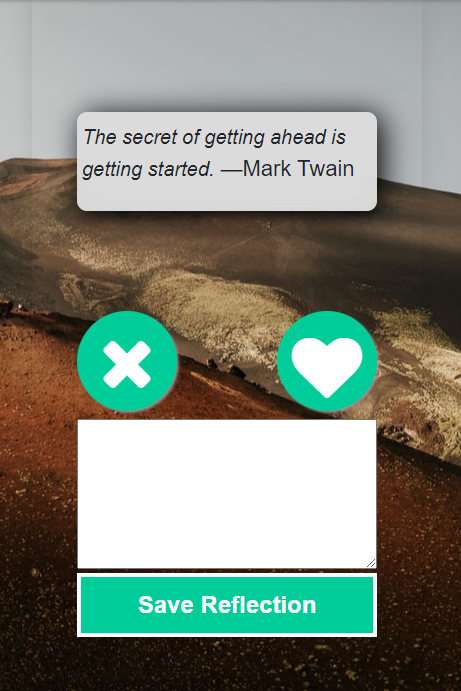
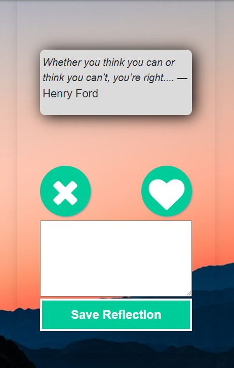

# Zen App

    

  ## Description:

 An inspiring bullet journal for the digital age.

Zen App is built on a NodeJS backend, with Express for server/routing, Sequelize for database handling, Handlebars for views, and is hosted on Heroku. It makes use of two external APIs, which are called once a day to build an image/quote pairing. 

Users (authenticated via Passport with password encryption by bCrypt.js) have the option to write short reflections on the quotes they find inspiring, and can make use of a daily checklist in the app or look at past reflections.

This project was initially built in Sept. 2020 over 10 days by 5 people.

[Link to the Deployed Site](https://mighty-gorge-04831.herokuapp.com/)     ||    [Link to the GitHub Repo](https://github.com/GAFelton/zen-app)



  ## Table of Contents

 * [Installation](#Installation)
 * [Usage](#Usage)
 * [License](#License)
 * [Contributing](#Contributing)
 * [Tests](#Tests)
 * [Contributors](#Contributors)
 * [Questions](#Questions)

  

  ## Installation

1. Fork the [repo](https://github.com/GAFelton/zen-app).

2. Clone the repo to your local machine.

3. On your local repo, run `npm install` for npm packages.

4. Create a MySQL database called `zen_db`, and enter your MySQL credentials into `config/config-default.json`.

5. Create a  file titled `.env` in the root folder. Inside it, you will include your API keys. Sign up for free API keys from [Unsplash](https://unsplash.com/developers) and [They Said So](https://theysaidso.com/api/#qod).
   Format for .env file:

   ```
   PB_KEY={your quotes.rest key here}
   US_KEY={your unsplash key here}
   ```

6. Run `npm start` to start your node server, and visit `localhost:8080` to interact with Zen App.

  

  ## Usage

  Open the [url](https://mighty-gorge-04831.herokuapp.com/) (https://mighty-gorge-04831.herokuapp.com/) and create a user account. Once created, you will have access to Zen app whenever you like. Your credentials are encrypted and your entries are secure. Each day, a new image/quote pairing will be available, and you are invited to take a moment to write a short reflection. 



  ## License

  [MIT](./LICENSE)

  

  ## Contribution Guidelines

  Reach out if you'd like to collaborate.  Raising an issue, or Pull Requests are welcome!

  

  ## Tests

  Run `npm test` for an ESLint test.

  

## Contributors

| Name                                                | Role      |
| --------------------------------------------------- | :-------- |
| [sarahcowgill](https://github.com/sarahcowgill)     | Back-end  |
| [GAFelton](https://github.com/GAFelton)             | Back-end  |
| [cheyennehunt99](https://github.com/cheyennehunt99) | Front-end |
| [sheikb08](https://github.com/sheikb08)             | Front-end |
| [mavn2](https://github.com/mavn2)                   | Back-end  |


  ## Questions

  Please address questions to [GAFelton](https://github.com/GAFelton). ([E-mail](64555318+GAFelton@users.noreply.github.com))

  
