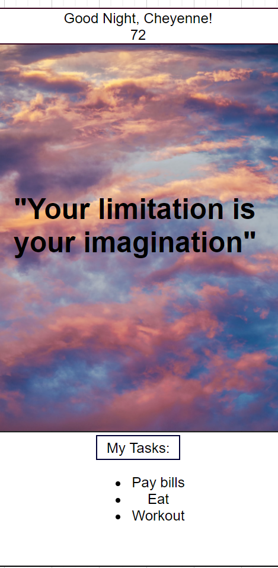

## Zen App

Zen app is your personalized home tab, to help you start every browsing session off right.

### Group

| Name          | Role      |
| ------------- | :-------- |
| Sarah Cowgill | Back-end  |
| George Felton | Back-end  |
| Cheyenne Hunt | Front-end |
| Brandon J     | Front-end |
| Max Nicolai   | Back-end  |

### User Story

```
As someone browsing the web
I want my new tab to help me focus and inspire me
So that I can start each browsing session with peace.
```



### Functionality

-Displays an inspirational quote over a beautiful image.

-Displays weather by user location.

-Daily Checklist Widget [user can add tasks which will then renew each day as a todo list.]

-Diary Widget [user can write text each day that will be saved to a diary entry at EoD]. (Future Implementation).


### Tools

##### APIs:

* Quotes

* Images

* Weather

##### Database:

* User info.
  * ID (PK)
  * First Name
  * Last Name
  * email
  * password
  * favorite quotes

* Checklist Info.
  * Task ID (PK)
  * Text
  * Completed
  * Hidden
  * UserID (FK)


  # Notes:

  ### Endpoints:
  ```
 Sign-up Page
   POST users

 Login Page
   GET users
   POST users

 Main Page
   GET users
   GET checklist
   GET ALL checklist
   GET favorite_quote
   GET favorite_quote BY favorite_quote.id
   POST checklist
   POST favorite_quote
   UPDATE checklist
   UPDATE favorite_quote

 View Favorite Quotes Page
   GET favorite_quote
   GET ALL favorite_quote
   UPDATE favorite_quote
```